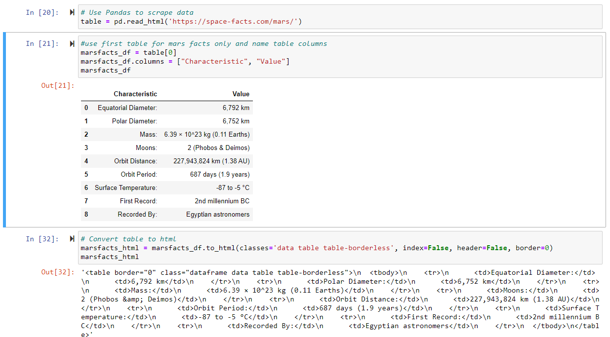
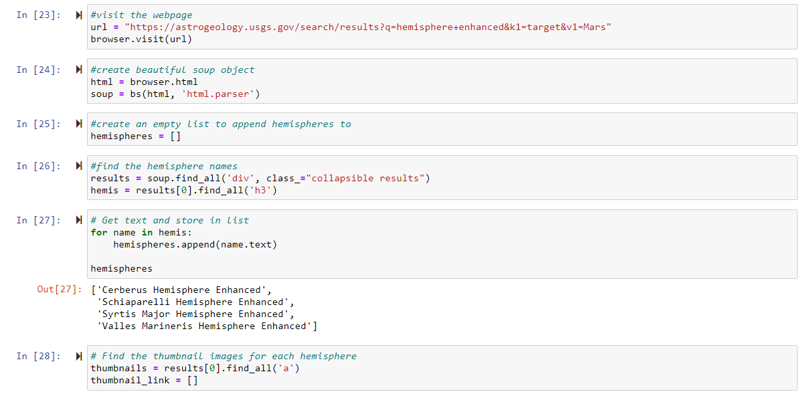
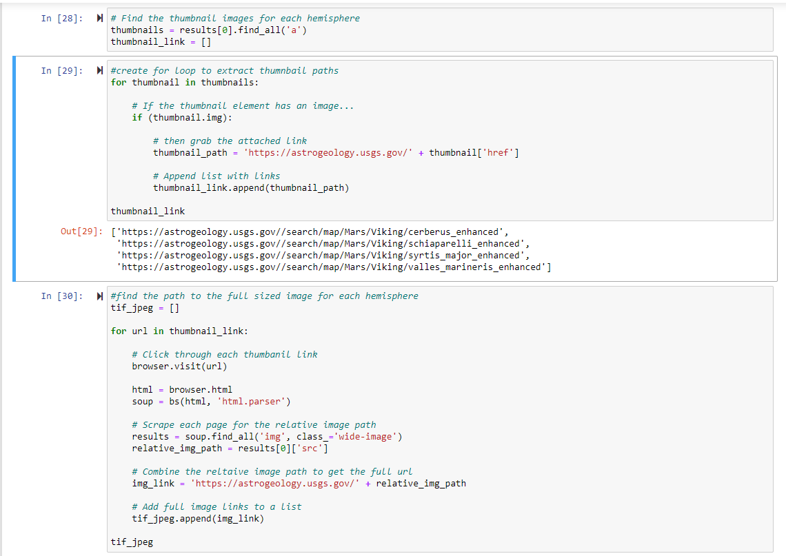
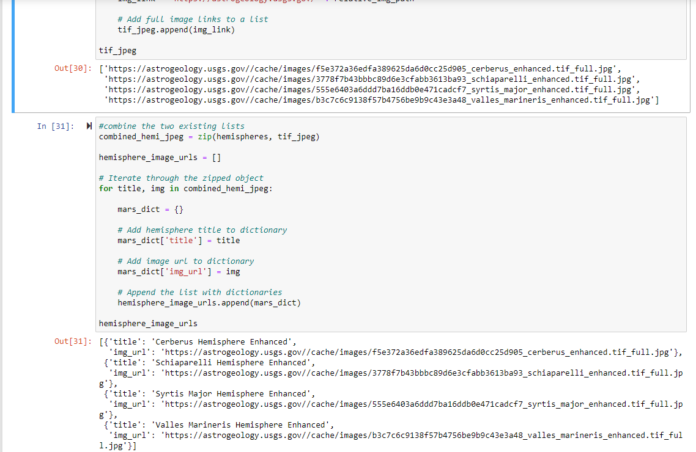
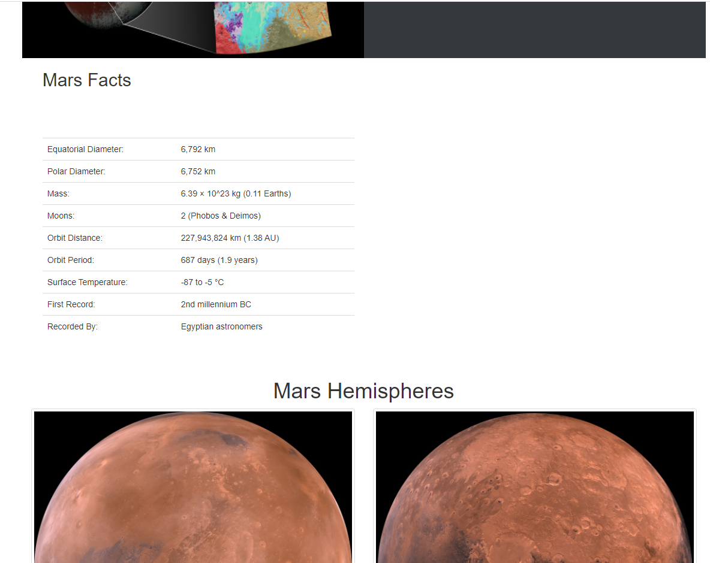
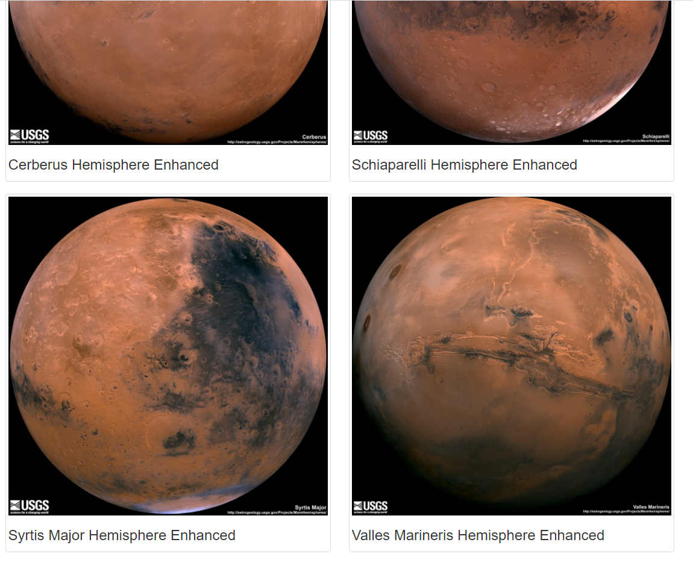

# Mission to Mars (Web Scraping Application)

## Background 
I have built a web application that scrapes various websites for data related to the Mission to Mars and displays the information in a single HTML page. The following outlines what work was completed.

## Step 1 - Scraping
Initial scraping using Jupyter Notebook, BeautifulSoup, Pandas, and Requests/Splinter.

### NASA Mars News

Scrape the NASA Mars News Site and collect the latest News Title and Paragraph Text.

### JPL Mars Space Images - Featured Image

* Visit the url for JPL Featured Space Image.
* Use splinter to navigate the site and find the image url for the current Featured Mars Image and assign the url string to a variable called featured_image_url.

### Mars Facts

* Visit the Mars Facts webpage here and use Pandas to scrape the table containing facts about the planet including Diameter, Mass, etc.
* Use Pandas to convert the data to a HTML table string.

### Mars Hemispheres

* Visit the USGS Astrogeology site here to obtain high resolution images for each of Mar's hemispheres.
* Save both the image url string for the full resolution hemisphere image, and the Hemisphere title containing the hemisphere name. Use a Python dictionary to store the data using the keys img_url and title.
* Append the dictionary with the image url string and the hemisphere title to a list. This list will contain one dictionary for each hemisphere.

## Step 2 - Mongo DB and Flask Application

* Use MongoDB with Flask templating to create a new HTML page that displays all of the information that was scraped from the URLs above.
* Convert the Jupyter notebook into a Python script called scrape_mars.py with a function called scrape that will execute all of your scraping code from above and return one Python dictionary containing all of the scraped data.
* Next, create a route called /scrape that will import the scrape_mars.py script and call the scrape function.
* Store the return value in Mongo as a Python dictionary.
* Create a root route / that will query Mongo database and pass the mars data into an HTML template to display the data.
* Create a template HTML file called index.html that will take the mars data dictionary and display all of the data in the appropriate HTML elements.

### All files completed and used are uploaded here
